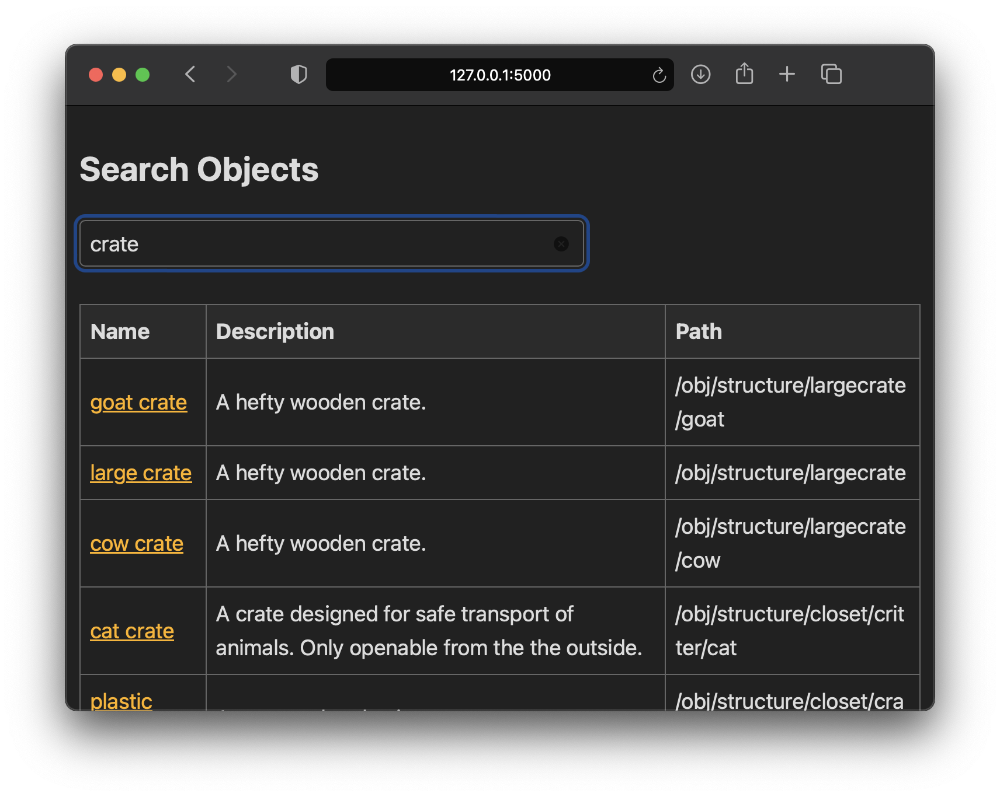
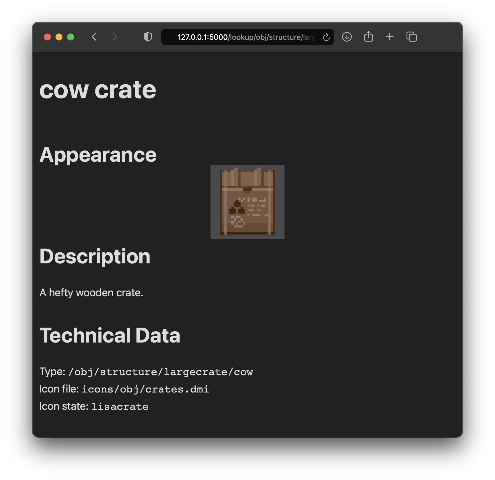

# Avulto Example: Webref

This directory contains a small webapp written in Flask used to demonstrate
several aspects of the Avulto library, namely retrieving object definition and
icon data on the fly.

To run it, install the dependencies from `requirements.txt`, change the
variables `ROOT_PATH` and `ENV_FILE` to match your local SS13 codebase, run
`python -m flask --app app run`, and then navigate to `127.0.0.1:5000` in your
web browser.

This demonstration contains a copy of the `htmx` library, which is Copyright (c)
2020, Big Sky Software and licensed under BSD 2-Clause.